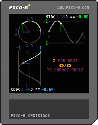
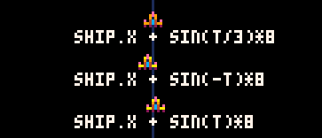
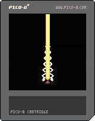
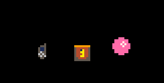
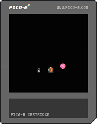
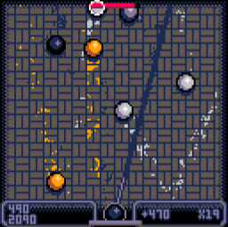
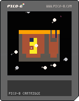
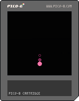

# Tips 'n Tricks Week 2
1. ~~Gravity and Momentum~~
2. ~~Setting up a Sublime Text programming environment for PICO-8~~
3. Wavy Text and Effects


## Wavy Text and Wavy Effects

Wavy movements and patterns are great for making things look fluid and organic.   
They can easily be made with the `sin` and `cos` functions. Before you freak out about needing to use math, it's ok, PICO-8 makes this easy for us!


### Understanding `sin` and `cos`

Let's take a step back now and try to understand what's actually happening here.  
`sin` and `cos` in PICO-8 are like Sine and Cosine in math but PICO-8 made some changes so that it's easier for us to think about.

Here's a cart to help you see how `sin` and `cos` work.  
  
Grab the `.png` and put it in your PICO-8 [or **try it here**](https://www.lexaloffle.com/bbs/?tid=30001)  

Sine and Cosine take an angle in degrees or radians and gives a number between -1 and 1.
PICO-8's `sin` and `cos` does the same thing but they take an angle between 0 and 1 instead. An angle of **1** refers to **one full turn**. That means **0.5** would be **half a turn** and a **quarter of a turn** would be **0.25**. That's a lot simpler than needing to use 2π and π/2 or 90 and 360!


According to [the docs](http://pico-8.wikia.com/wiki/Sin), PICO-8's is inverted. That means `sin(.25)` is -1 instead of 1, so make sure that doesn't trip you up when you get back to math class!

### Get on with the effects!

Now that we got all the explaining out of the way, let's make some cool effects!

We're not going to memorize at all the numbers that come out of `sin` or `cos` like you might in math class. Instead we're just going to notice that it gives us a number between -1 and 1. That means if we add it to a value, let's say 64, we'll get a number that varies between 63 and 65.  
If we want a **larger variation**, we just **multiply** the -1 and 1 by something.

  
\* *notice, `T` in the above gif increases by 0.015 every frame instead of 1. I'll let you figure out why.*

Want it to go **slower**? Just **divide** `T` by something so that the angle increases by smaller increments.  
Want to **reverse the direction**? Just **reverse the angle**!  



### What can you do with that?

That's about it! With that you can do a ton of quick and easy effects. Here's some things you can do with it:

#### Wavy Logos

  
The `HELLO.P8` cart in your `DEMOS` directory is a good example of this.

#### Enemy Movement Patterns


```lua
-- for example
for e in all(enemies) do
 e.x = e.originx + sin(e.time) * 6
end
```

#### Fancy Weapon Effects




#### Giving Items Some Character




### Advanced Uses
`sin` and `cos` also opens the doors for rotation based player controls as well as **3D**!

  
[Combo-Pool](https://www.lexaloffle.com/bbs/?tid=3467) is a good example of rotation-based control  


 


### Resources

[twitter gif visualizing `sin` and `cos`](https://twitter.com/MBoffin/status/905191907294199808)   

<details>
    <summary>PG13 Warning: Swearing</summary>
    [Why turn-based angles?](https://trasevol.dog/2017/06/08/doodle-insights-17-a-case-for-turn-based-angles/)
</details>


## Bonus Stuff!

### Simple Gravity Demo



### Centering Text
